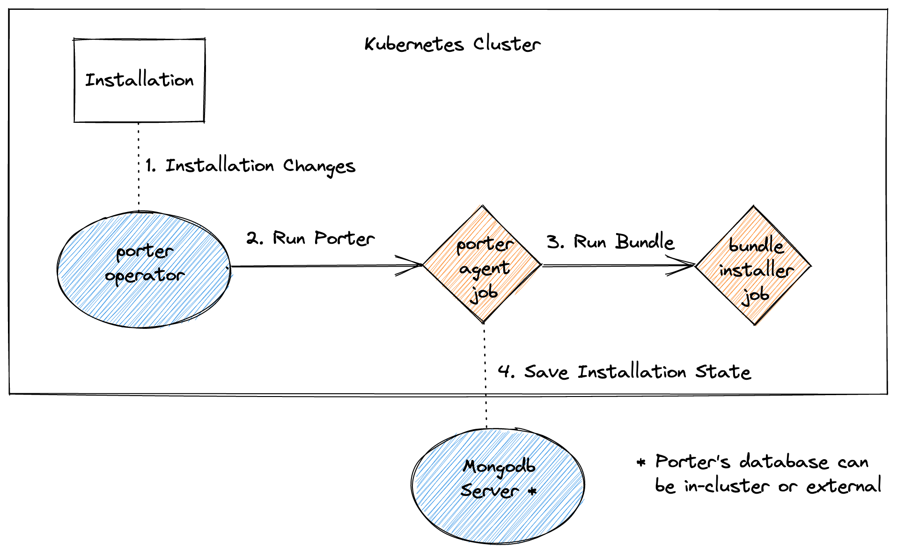

We are currently working on creating a Kubernetes operator for Porter.
With Porter Operator, you define installations, credential sets and parameter sets in custom resources on a cluster, and the operator handles executing Porter when the desired state of an installation changes.
Learn more about Porter manages desired state in the [Desired State QuickStart].

The operator is not ready to use.
The initial prototype gave us a lot of feedback for how to improve Porter's support for desired state, resulting in the new [porter installation apply] command.
We are currently rewriting the operator to make use of this new command and desired state patterns.

You can watch the https://github.com/getporter/operator repository to know when new releases are ready, and participate in design discussions.

## Terms

### Operator

The Porter Operator is a service that runs on a Kubernetes cluster.
It uses Custom Resource Definitions (CRDs) to define Installations, Credential and Parameter Sets.
The operator watches these resources and actions are triggered when they are modified.
For example, creating an Installation CRD causes the corresponding bundle to be installed.
Modifying that Installation CRD later causes the Installation to be upgraded.
The Installation is uninstalled when the CRD is deleted.

### Porter Agent

The Porter Operator runs the porter CLI in jobs on the Kubernetes cluster.
The image used for those jobs is called the **Porter Agent**.

### Agent Config

How the Porter Agent is executed is configurable with the [**AgentConfig** CRD](/operator/file-formats/#agent-config).

### Porter Config

The porter CLI has a [configuration file] when run normally on your local computer. When it's run inside the Porter Agent, you can populate the config file with a [PorterConfig CRD](/operator/file-formats/#porter-config).

[porter installation apply]: /cli/porter_installations_apply/
[configuration file]: /configuration/
[Desired State QuickStart]: /quickstart/desired-state/

## Next Steps

* [QuickStart](/operator/quickstart/)
